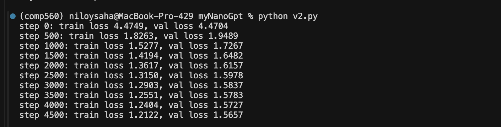

# myNanoGpt

Building GPT from scratch following Andrej Karpathy's [Let's build GPT](https://www.youtube.com/watch?v=kCc8FmEb1nY) video series.

## What's Here

- **`bigram.py`** — Simple bigram language model (starting point)
- **`v2.py`** — Full decoder-only transformer (6 layers, 6 heads, 384 embedding dims)
- **`gpt-dev.ipynb`** — Development notebook
- **`EXPLAIN.md`** — Detailed explanation of the model architecture
- **`my-experiment/`** — Onboarding quick-test experiment using `comp560-nanoGPT`

## Training Results (Shakespeare, MPS)

Trained on Tiny Shakespeare (~1MB) on a MacBook Pro with Apple Silicon MPS. Took about **1 hour**.

| Hyperparameter | Value |
|:---|:---|
| `batch_size` | 32 |
| `block_size` | 256 |
| `n_embd` | 384 |
| `n_head` | 6 |
| `n_layer` | 6 |
| `dropout` | 0.2 |
| `learning_rate` | 3e-3 |
| `max_iters` | 5000 |
| `device` | MPS (Apple Silicon) |

```
step    0: train loss 4.4749, val loss 4.4704
step 4500: train loss 1.2122, val loss 1.5657
```



## Setup

Trained on MacBook using Apple Silicon MPS. Requires PyTorch with MPS support.

```bash
pip install torch
python v2.py
```
