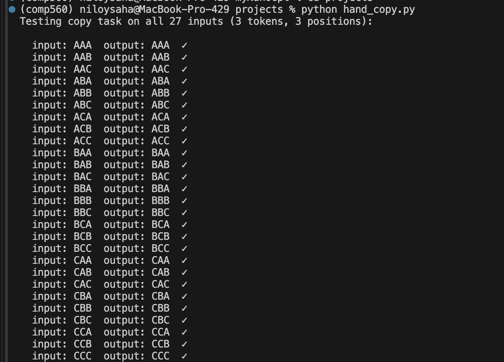
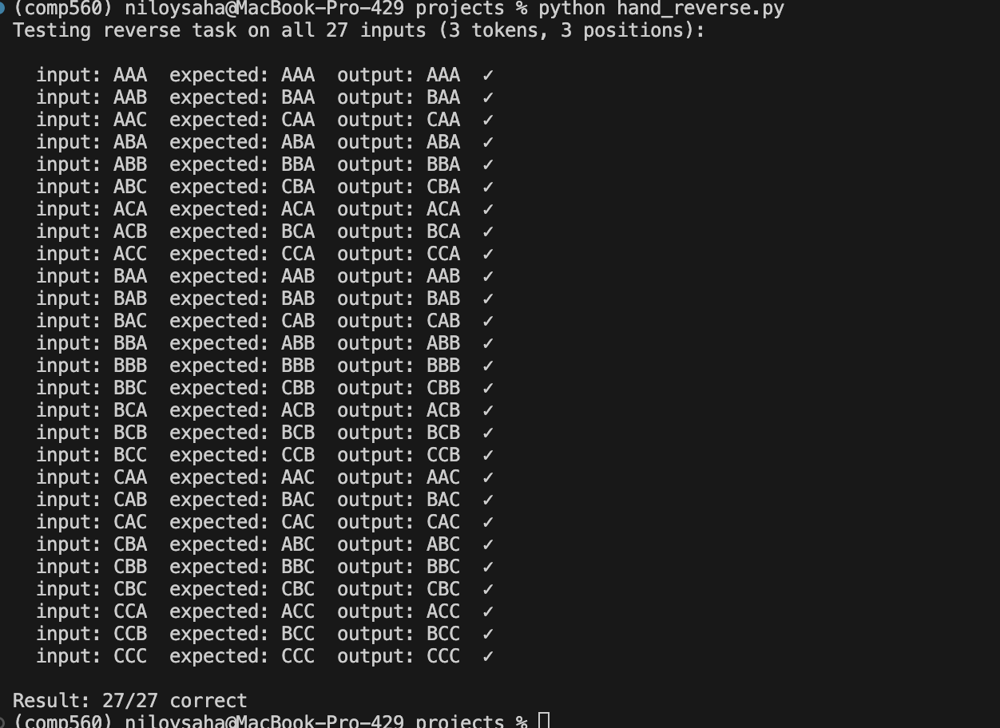

# Hand-Designed GPT Projects

These projects are part of a research task from COMP560: figure out how to design certain GPTs by hand, then implement and test in PyTorch — with no training at all.

Instead of letting gradient descent find the weights, we calculated the exact numbers ourselves and hardcoded them directly into the model.

---

## Project 1: Copy

**Task**: Given input `A B C`, output `A B C` (copy it exactly).

### What we did

The copy task doesn't need attention or any real computation. We set:
- **Token embedding = identity matrix** — each token becomes a unique one-hot vector (`A → [1,0,0]`, etc.)
- **All attention and FFN weights = zero** — they contribute nothing
- **Unembedding = identity matrix** — the one-hot vector maps straight back to the correct token

The residual connection just carries the embedding through the whole network unchanged.

### Result

**27/27 correct** on all possible 3-character inputs.

---

## Project 2: Reverse

**Task**: Given input `A B C`, output `C B A` (reverse it).

### What we did

This one actually needed real attention engineering. We needed an **anti-diagonal attention pattern** — output position 0 reads from input position 2, position 1 reads from position 1, position 2 reads from position 0.

We split `n_embd = 6` into two channels:
- **Dims 0–2**: carry the token content (what the character is)
- **Dims 3–5**: carry the position (where the character is)

Then we designed the weight matrices by hand:
- `W_Q` extracts the position of the current output slot
- `W_K` extracts the **flipped** position of each input slot
- So `Q[0] · K[2] = 1` (attend!) and `Q[0] · K[0] = 0` (ignore) — position 0 attends to position 2
- `W_V` extracts just the token content to pass through

We also removed the causal mask since output position 0 needs to look *forward* to input position 2.

### Result

**27/27 correct** on all possible 3-character inputs.

---

## Conclusion

Both projects together reveal something fundamental about how transformers work:

1. **Attention is a routing mechanism** — it decides *which* input positions to read from, not what to compute. `Q` and `K` handle the routing, `V` handles the content.

2. **The residual stream is the backbone** — information flows through the network via residual connections. Attention and FFN layers just add corrections on top.

3. **Training finds what we did by hand** — when you train a GPT normally, gradient descent is finding the same kind of weight patterns we constructed manually. The mechanism is identical; training just automates the search.

4. **Design choices matter** — the causal mask, the embedding size, the number of channels — these aren't arbitrary. Each one enables or prevents certain computations. We had to remove the causal mask for reverse because the task requires looking forward.

In short: a transformer is a **programmable information router**. Gradient descent is just one way to program it.
