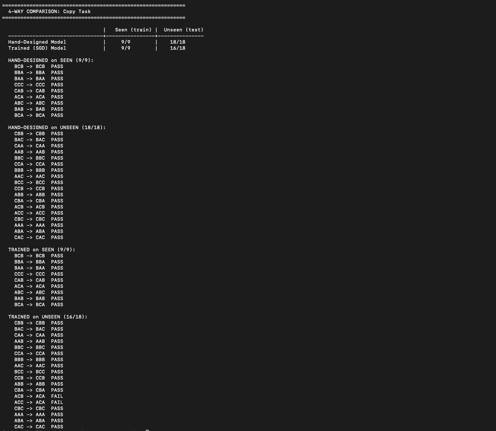
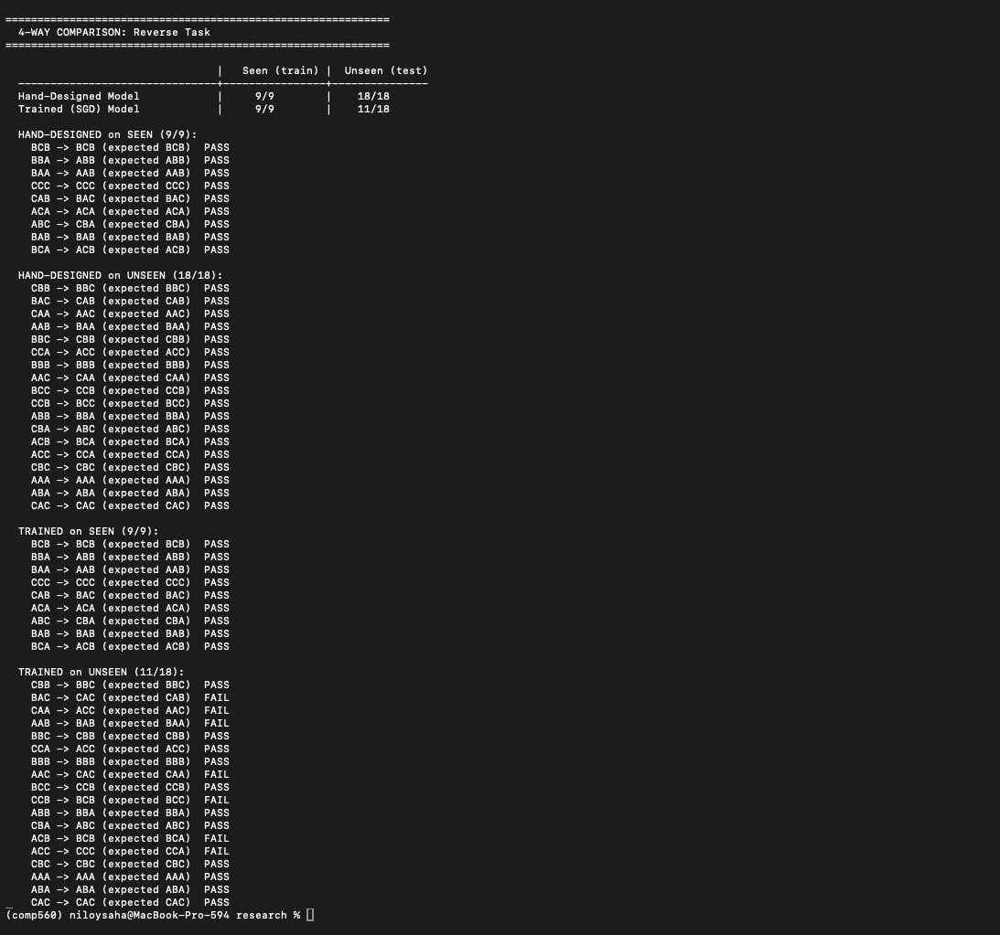
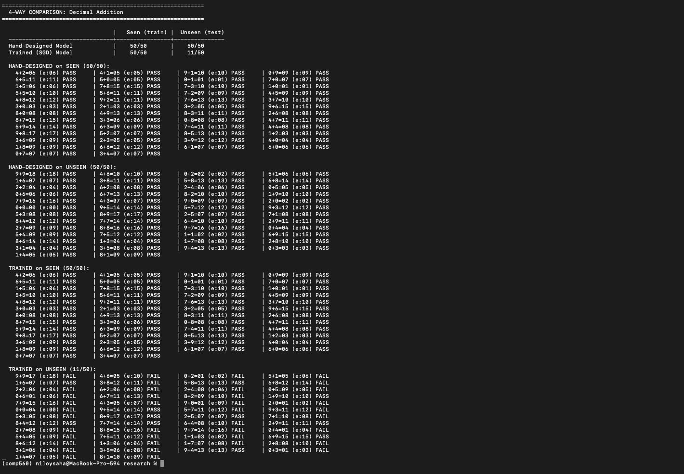

# Hand-Designed vs. Trained Transformers: Do They Learn the Same Algorithms?

## What This Is

For COMP560, I built a set of tiny GPT models where I set every weight by hand to perform specific tasks (copy, reverse, addition). These hand-designed models work perfectly because they encode the actual algorithm -- no training needed.

This raised a natural question: **if I train the same architecture from scratch using gradient descent, does the trained version generalize to inputs it's never seen?**

---

## Setup

### The Architecture

Every model -- hand-designed and trained -- uses the exact same GPT architecture:

```
Token Embedding -> Position Embedding -> Block(LayerNorm -> Attention -> Residual -> LayerNorm -> FFN -> Residual) -> Final LayerNorm -> Linear Head
```

All models use **1 layer, 1 attention head, and no dropout**. The only things that change between tasks are `vocab_size`, `n_embd`, and `block_size`.

### The Tasks

| Task | What it does | Vocab | n_embd | Total possible inputs |
|------|-------------|-------|--------|-----------------------|
| Copy | `ABC<sep>` -> `ABC` | 4 | 11 | 27 |
| Reverse | `ABC<sep>` -> `CBA` | 4 | 11 | 27 |
| Decimal Addition | `a+b=` -> two-digit sum | 12 | 25 | 100 |

### What I Did

Trained each model on only a *subset* of examples, then tested on held-out inputs it had never seen. Both the hand-designed and trained models are tested on the same seen and unseen splits.

| Task | Trained on | Tested on (unseen) |
|------|-----------|-------------------|
| Copy | 9 of 27 (33%) | 18 of 27 (67%) |
| Reverse | 9 of 27 (33%) | 18 of 27 (67%) |
| Decimal Addition | 50 of 100 (50%) | 50 of 100 (50%) |

Training used AdamW (lr=1e-3), 5,000 steps for copy/reverse and 20,000 for addition. All models hit near-zero training loss.

---

## Results

### 4-Way Comparison

Each task is tested in all 4 combinations: hand-designed on seen, hand-designed on unseen, trained on seen, trained on unseen.

**Copy**

|  | Seen (9) | Unseen (18) |
|--|----------|-------------|
| Hand-Designed | 9/9 | 18/18 |
| Trained (SGD) | 9/9 | 16/18 |



**Reverse**

|  | Seen (9) | Unseen (18) |
|--|----------|-------------|
| Hand-Designed | 9/9 | 18/18 |
| Trained (SGD) | 9/9 | 11/18 |



**Decimal Addition**

|  | Seen (50) | Unseen (50) |
|--|-----------|-------------|
| Hand-Designed | 50/50 | 50/50 |
| Trained (SGD) | 50/50 | 11/50 |



### Observations

**Copy** -- the trained model nearly generalizes perfectly (16/18). The task is simple enough (look 3 positions back) that SGD discovers a working rule from just 9 examples.

**Reverse** -- the trained model gets only 11/18 unseen inputs correct (61%). It learned partial patterns that happened to work on the training set but didn't capture the full reversal logic. Example failures:
- `BAC -> CAC` (should be `CAB`)
- `AAB -> BAB` (should be `BAA`)
- `ACB -> BCB` (should be `BCA`)

**Addition** -- the trained model gets only 11/50 unseen sums correct (22%). It shows no evidence of having learned the actual addition algorithm. Example failures:
- `0+0 -> 04` (should be `00`)
- `1+1 -> 03` (should be `02`)
- `9+9 -> 17` (should be `18`)
- `9+0 -> 01` (should be `09`)

The hand-designed model gets **100% on everything** because it encodes the algorithm itself.

---

## What I Learned

### 1. Generalization depends on task complexity

| Task complexity | Generalization |
|----------------|---------------|
| Simple routing (copy) | SGD nearly learns the rule |
| Position-dependent routing (reverse) | Partial -- works for some inputs |
| Compositional reasoning (addition) | SGD memorizes, doesn't generalize |

The more computation a task requires (not just moving tokens around), the worse the trained model generalizes.

### 2. Hand-designed models have a fundamental advantage

They encode the *algorithm*, not the *data*. They need zero training examples and generalize perfectly. But this advantage only exists for tasks simple enough that a human can figure out the correct weights -- for complex real-world tasks (like language), training is the only option.

### 3. Memorization is not understanding

Both models get 100% on training data, but only the hand-designed model handles unseen inputs. The trained model memorizes input-output pairs rather than learning the underlying rule.

---

## Limitations

- These are intentionally tiny models (1 layer, 1 head). Bigger models might generalize better.
- Training data is very small (9--50 examples). Real models train on millions.
- I didn't try regularization (dropout, weight decay), which could improve generalization.
- Results are for simple deterministic tasks and may not directly apply to natural language.

---

## How to Reproduce

```bash
cd myNanoGpt/research
conda activate comp560

python generalize_copy.py
python generalize_reverse.py
python generalize_addition.py
```

Each script trains a model on the subset, builds the hand-designed model, and prints the full 4-way comparison table with every individual prediction.

## Files

| File | What it does |
|------|-------------|
| `model.py` | Shared GPT architecture (all scripts import from here) |
| `generalize_copy.py` | 4-way comparison: copy (9 train / 18 test) |
| `generalize_reverse.py` | 4-way comparison: reverse (9 train / 18 test) |
| `generalize_addition.py` | 4-way comparison: decimal addition (50 train / 50 test) |
| `REPORT.md` | This report |
